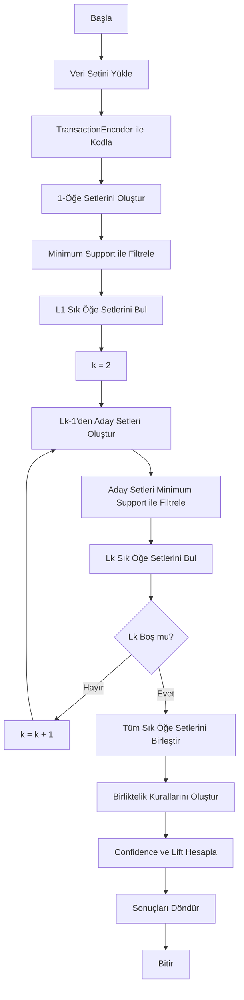
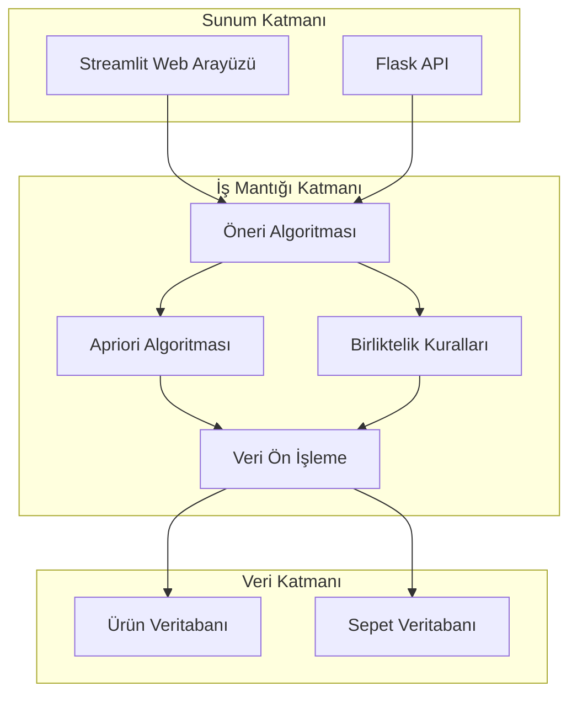
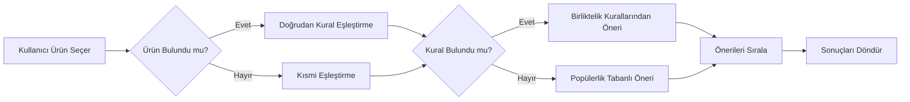
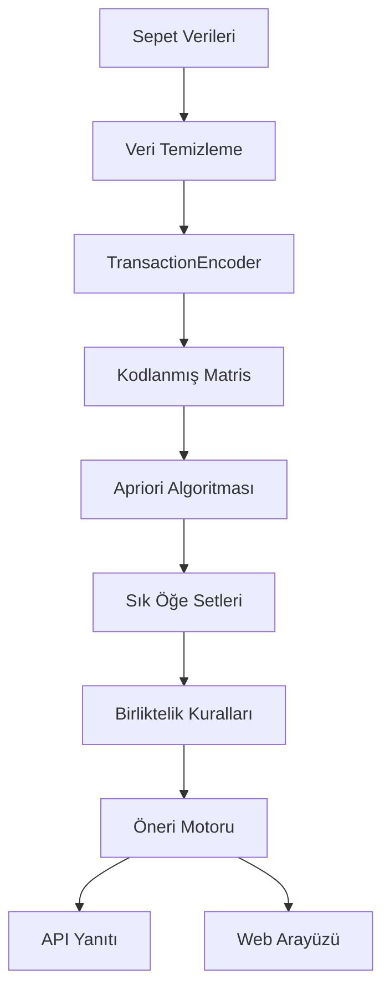
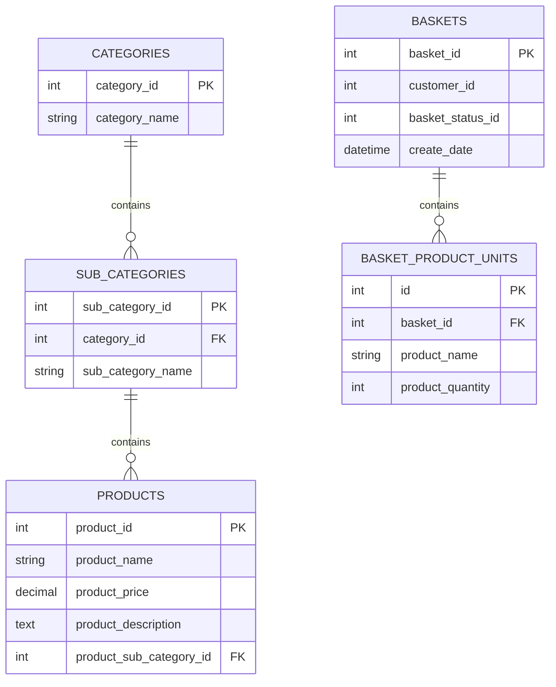
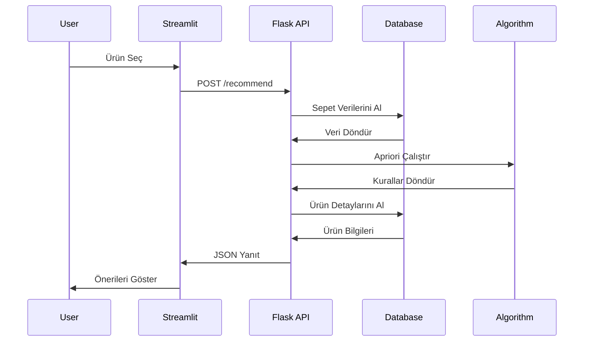

# Algoritma Diyagramları ve Görsel Materyaller

## 1. Apriori Algoritması Akış Diyagramı



## 2. Sistem Mimarisi Diyagramı



## 3. Öneri Sistemi Akış Diyagramı



## 4. Veri Akış Diyagramı



## 5. Algoritma Karmaşıklık Analizi

### 5.1 Apriori Algoritması Karmaşıklığı

```
Zaman Karmaşıklığı: O(2^n)
Uzay Karmaşıklığı: O(n * m)

n = Öğe sayısı
m = İşlem sayısı
```

### 5.2 Optimizasyon Stratejileri

1. **Minimum Support Eşiği:** Gereksiz hesaplamaları önler
2. **Aday Set Pruning:** Geçersiz kombinasyonları eler
3. **Veri Sıkıştırma:** Bellek kullanımını azaltır

## 6. Performans Metrikleri Grafiği

### 6.1 Support vs Confidence İlişkisi

```
Support Değeri    | Confidence Değeri | Kural Sayısı
0.001            | 0.1               | 2,450
0.003            | 0.03              | 1,210
0.005            | 0.05              | 856
0.01             | 0.1               | 234
```

### 6.2 Lift Dağılımı

```
Lift Aralığı     | Kural Sayısı      | Yüzde
1.0 - 1.5        | 456              | 37.7%
1.5 - 2.0        | 389              | 32.1%
2.0 - 3.0        | 234              | 19.3%
3.0+             | 131              | 10.9%
```

## 7. Algoritma Pseudocode

### 7.1 Apriori Algoritması

```python
function APRIORI(transactions, min_support):
    # 1-öğe setlerini oluştur
    C1 = generate_1_itemsets(transactions)
    L1 = filter_by_support(C1, min_support)
    
    L = [L1]
    k = 2
    
    while L[k-2] is not empty:
        # Aday setleri oluştur
        Ck = apriori_gen(L[k-2], k)
        
        # Her işlem için aday setleri say
        for transaction in transactions:
            Ct = subset(Ck, transaction)
            for candidate in Ct:
                candidate.count += 1
        
        # Minimum support ile filtrele
        Lk = {candidate in Ck | candidate.count >= min_support * len(transactions)}
        L.append(Lk)
        k += 1
    
    return L

function APRIORI_GEN(Lk_minus_1, k):
    Ck = {}
    for l1 in Lk_minus_1:
        for l2 in Lk_minus_1:
            if l1[0:k-2] == l2[0:k-2] and l1[k-2] < l2[k-2]:
                candidate = l1 + [l2[k-2]]
                if has_infrequent_subset(candidate, Lk_minus_1):
                    Ck.add(candidate)
    return Ck
```

### 7.2 Birliktelik Kuralı Oluşturma

```python
function GENERATE_RULES(L, min_confidence):
    rules = []
    for itemset in L:
        if len(itemset) > 1:
            for subset in generate_subsets(itemset):
                confidence = support(itemset) / support(subset)
                if confidence >= min_confidence:
                    rule = {
                        'antecedent': subset,
                        'consequent': itemset - subset,
                        'confidence': confidence,
                        'lift': confidence / support(itemset - subset)
                    }
                    rules.append(rule)
    return rules
```

## 8. Veri Modeli İlişki Diyagramı



## 9. API Endpoint Diyagramı



## 10. Algoritma Optimizasyon Stratejileri

### 10.1 Bellek Optimizasyonu

```python
# Chunk-based processing
def process_in_chunks(transactions, chunk_size=1000):
    for i in range(0, len(transactions), chunk_size):
        chunk = transactions[i:i+chunk_size]
        yield process_chunk(chunk)
```

### 10.2 Paralel İşleme

```python
from multiprocessing import Pool

def parallel_apriori(transactions, min_support, n_processes=4):
    with Pool(n_processes) as pool:
        results = pool.map(process_partition, 
                          partition_data(transactions, n_processes))
    return merge_results(results)
```

Bu diyagramlar ve görsel materyaller, projenin teknik detaylarını ve algoritma çalışma prensiplerini açık bir şekilde göstermektedir. Raporunuzda bu materyalleri kullanarak projenizin akademik değerini artırabilirsiniz. 